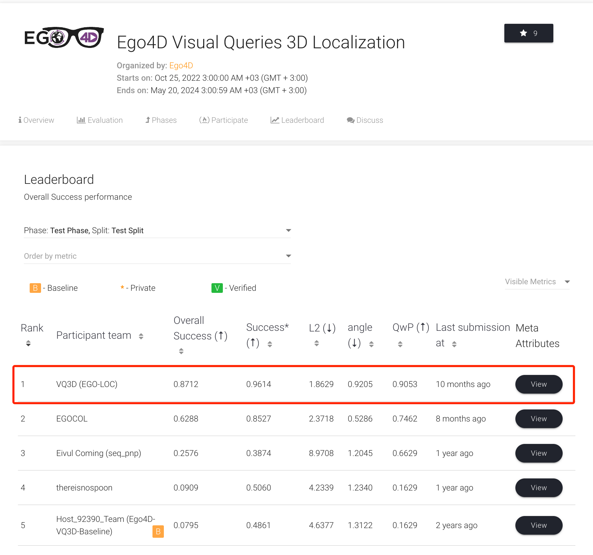

# EgoLoc: Revisiting 3D Localization from Egocentric Videos with Visual Queries (ICCV 2023) [Oral]


*The implementation of 1st winner for VQ3D challenge in Ego4D Workshop at CVPR 2023 and ECCV 2022.*

## Readme

1. This repo borrows some code from our previous work at [ECCVW 2022](https://github.com/Wayne-Mai/VQ3D_ECCVW2022).
2. Our validation report v1 is available on [arXiv](https://arxiv.org/abs/2212.06969).
3. TODO List
- [x] Init Code, Oct 2023
- [x] Add 2D Detector inference code, Oct 2023
- [x] Code optimization, Jan 2024
- [x] Add all pre-computed results before and include 2D object retrieval, Jan 2024
- [x] Add MV-aggregation code, Jan 2024
- [x] Add pre-computed camera poses for validation and test set, Jan 2024
- [x] Add re-organized test code, Jan 2024
- [ ] Add visualization code
- [ ] Set up Github pages


## Installation

Install COLMAP 3.8 from the source if you want faster reconstruction. 
```bash
git clone --branch 3.8 https://github.com/colmap/colmap.git
cd colmap
git checkout dev
mkdir build
cd build
cmake .. -GNinja
ninja
sudo ninja install
```

As v3.8 is the latest version supported by [pycolmap](https://github.com/colmap/pycolmap),
you can also install pycolmap which provides options to install prebuilt binaries for COLMAP.


And then create the Python environment for EgoLoc:
```bash
conda env create -f environment.yml
```
Any python version (>=3.7,<=3.9) compatible with COLMAP 3.8 and pycolmap should work.


### Using precomputed results
Note if you decide to use our precomputed results in all the following steps, you don't have to install COLMAP and pycolmap. Optionally, we have provided precomputed camera intrinsics and camera poses inside `data` and [this shared Google Drive folder](https://drive.google.com/drive/folders/1hmCfNT3rolj_llIRc8UUKpaw1Chppv-Y?usp=sharing). 

## TL,DR

 **If you find the steps below are too long to follow, don't worry. We provide a Python script to reproduce our result using precomputed intermediate results in SECONDS.**

First, you only need to clone and download compressed `clips_frames.zip` and other required files from [this shared Google Drive folder](https://drive.google.com/drive/folders/1hmCfNT3rolj_llIRc8UUKpaw1Chppv-Y?usp=sharing).

Your data structure should look like this:

```python
- 2d_retrieval
        - data
                - baseline_val{test}_challenge_predictions.json
                - ...json
- data
        - clips_frames
        - metadata
        - precomputed
                - all_val_test_pose.json

```

And then run the following to quickly reproduce our reported result on the paper:
```bash
python run.py \
        --pose_dir data/precomputed/all_val_test_pose.json \
        --output_filename data/vq3d_results/egoloc_val.json \
        --vq2d_annot data/metadata/val_annot_vq3d.json \
        --vq2d_queries data/metadata/vq_val_vq3d.json \
        --vq2d_results 2d_retrieval/data/vq2d_val_vq3d_peak_clip.json \
        --mode val --experiment mf_weighted2d

python eval.py --vq3d_results data/vq3d_results/egoloc_val_mf_weighted2d_val.json
```

More details and settings please go to [## Evaluation and test]() section.

## Camera Pose Estimation

### Start from scratch
Follow [Ego4D VQ3D Benchmark](https://github.com/EGO4D/episodic-memory/blob/main/VQ3D/README.md) to produce the required VQ2D result and baseline VQ3D results (e.g., video clip frames, camera intrinsics, camera poses from the baseline method).

The extracted video clip frames and camera intrinsics will be used later.
Note that Ego4D is using a modified hloc + SfM pipeline to get camera poses. You don't need their camera poses to reproduce our results.

We use a custom COLMAP with fine-tuned parameters for egocentric videos. Check the script `run_colmap.sh` we provide in `ego_loc/scripts` to get camera poses from COLMAP from your own runs.
For example, if you are using a cloud server:

```bash
# Assume you have extracted clips_frames in data/clips_frames
# Start slurm array jobs, each array job will process one video clip in val/test,
# there're 44 vide clips in val and 69 in test, so set array to 0-113.
# Or you can run COLMAP for each video clip separately in a local machine. 
sbatch scripts/run_colmap.h
```

### Start from our preprocessed data
We have provided precomputed intrinsics in `data/precomputed/scan_to_intrinsics_egoloc.json` and camera poses in `all_val_test_pose.json`.
Also, please download our extracted clip frames from VQ3D video clips (val+test) from [this shared Google Drive folder](https://drive.google.com/drive/folders/1hmCfNT3rolj_llIRc8UUKpaw1Chppv-Y?usp=sharing). The size is around 175GB. Note that we also package our precomputed depth maps into it, which will be used in the view aggregation and inference later.

## Registration
### Start from scratch
Note that the groundtruth annotations for VQ3D are done by volunteers on the Matterport scans of the indoor scenes. But COLMAP reconstruction is regardless of coordinate system and scale. To evaluate the performance, we need to align the COLMAP reconstruction, i.e., the camera pose, with the Matterport scans' coordinate system. Please refer to our paper with supplementary materials on arXiv for more details.


To perform the registration, we randomly sweep the MP scans and sample the camera poses.
Then we render the virtual views and save them with corresponding poses in `data/geo_register`.

You can render your own virtual views with known poses using downloaded MP scans from Ego4D.
Now run this script to register COLMAP reconstructions to MP coordinate system.

```bash
bash scripts/register.sh
```

The alignment for each video clip takes around 5 minutes. Note we don't perform global bundle adjustment after registering new MP images, which is to guarantee that known MP scans won't leak geometric information to camera poses constructed only from egocentric videos.

After the alignment is done, you can extract the aligned camera poses from the reconstruction. EgoLoc uses the same camera pose format as Ego4D. So please also organize your camera poses as the following:

```python
{
    'clip_uid':{
        'good_poses': List[True|False], # len(List)=num_clip_frames
        'camera_poses':List[poses] # poses.shape=(3,4)
    }
}
```

Also check `data/precomputed/all_val_test_pose.json` to see how the pose is organized.

>*(Note: Actually during our experiment, we find that registration accuracy can affect the pose accuracy. Our registration is far from perfect and may also fail in some clips. If VQ3D challenge can provide groundtruth camera calibration for some egocentric video frames (3-5 frames per clip) on Matterport scans, as common practice in other indoor localization benchmarks, we believe our method can have higher performance.)*

### Start from our preprocessed data

Download our precomputed camera poses from [this shared Google Drive folder](https://drive.google.com/drive/folders/1hmCfNT3rolj_llIRc8UUKpaw1Chppv-Y?usp=sharing) and put it as  `data/precomputed/all_val_test_pose.json`.


## 2D Object Retrieval
### Start from scratch
Follow the [object retrieval readme](2d_retrieval/readme.md) in `ego_loc/2d_retrieval` to reproduce our 2D detection with visual query result, which may take 24 hours for 1 GPU to finish the inference.
However, downloading the required video clips and extracting them into frames can take several days.

### Start from our preprocessed data
Or you can alternatively use our precomputed results. You will need `data/clips_frames`, which are the frames extracted from VQ3D video clips. You will need `baseline_val_predictions.json` and `baseline_test_challenge_predictions.json` if you want to reproduce VQ3D results using vanilla VQ2D predictions by Ego4D. These three files can be downloaded from [this shared Google Drive folder](https://drive.google.com/drive/folders/1hmCfNT3rolj_llIRc8UUKpaw1Chppv-Y?usp=sharing) as they oversize Github's 50MB file limit.
You can find the other required 2D detection results `vq2d_val(test)_vq3d_peak_clip.json` to reproduce our EgoLoc results in `2d_retrieval/data/vq2d_val(test)_vq3d_peak_clip.json`.
Then you can safely skip the 2D object retrieval section and go ahead.


## Multiview Aggregation and Prediction

### Start from scratch

1. Prepare the depth estimator. Clone the DPT model and download the pretrained checkpoints: Monodepth finetuned on NYUv2: [dpt_hybrid_nyu-2ce69ec7.pt](https://github.com/intel-isl/DPT/releases/download/1_0/dpt_hybrid_nyu-2ce69ec7.pt) [Mirror](https\://drive.google.com/file/d/1NjiFw1Z9lUAfTPZu4uQ9gourVwvmd58O/view?usp=sharing)
```bash
git clone https://github.com/isl-org/DPT.git
```

2. If you have followed the previous steps to get `vq2d_val(test)_vq3d_peak_clip.json` and `data/precomputed/all_val_test_pose.json`, you can now go to [Evaluation and test](##Evaluation_and_test).


## Evaluation and Test
Carefully follow the steps in [Ego4D VQ3D Benchmark](https://github.com/EGO4D/episodic-memory/blob/main/VQ3D/README.md) to evaluate and test the results on [Eval AI Challenge](https://eval.ai/web/challenges/challenge-page/1646/leaderboard/3947).


### Validation Set

To reproduce our results on the validation set `(Tab. 1, Validation Set, EgoLoc)`, run:
```bash
python run.py \
        --pose_dir data/precomputed/all_val_test_pose.json \
        --output_filename data/vq3d_results/egoloc_val.json \
        --vq2d_annot data/metadata/val_annot_vq3d.json \
        --vq2d_queries data/metadata/vq_val_vq3d.json \
        --vq2d_results 2d_retrieval/data/vq2d_val_vq3d_peak_clip.json \
        --mode val --experiment mf_weighted2d
```
Check the comments on `run.py` to see details about the argument configurations. Then run `eval.py` to get the validation result:

```bash
python eval.py --vq3d_results data/vq3d_results/egoloc_val_mf_weighted2d_val.json
```

You should get the following results:
```python
L2:  1.4491434374406456
angular:  0.6070314515337882
Success* :  98.13664596273291
Success :  80.48780487804879
QwP ratio :  82.3170731707317
```

The aggregation method is controlled by `args.experiment`.
```bash
- mf: whether enable multiview aggregation
    - _weighted2d: use 2d detection score to do weighted aggregation, egoloc's default setting
- last: use last valid 2d detection frame, ego4d's default setting
```

For example, if you want to reproduce Ego4D's validation result with EgoLoc's camera poses + Ego4D's last frame + Ego4D's VQ2D output `(Tab. 1, Validation Set, Ego4D*)`, run:


```bash
python run.py \
        --pose_dir data/precomputed/all_val_test_pose.json \
        --output_filename data/vq3d_results/baseline_val.json \
        --vq2d_annot data/metadata/val_annot.json \
        --vq2d_queries data/metadata/vq_val.json \
        --vq2d_results 2d_retrieval/data/baseline_val_predictions.json \
        --mode val --experiment last
```

*(Note: When using prediction file from baseline Ego4D method, we need to use annotation and query file match with its format.)*


You should get exactly the same result as we provided in `(Tab. 1, Validation Set, Ego4D)` from the above two examples.


### Test Set

To reproduce our EgoLoc test result on [Eval AI](https://eval.ai/web/challenges/challenge-page/1646/leaderboard/3947), run:

```bash
python run.py \
        --pose_dir data/precomputed/all_val_test_pose.json \
        --output_filename data/vq3d_results/egoloc_test.json \
        --vq2d_results 2d_retrieval/data/vq2d_test_vq3d_peak_clip.json \
        --mode test --experiment mf_weighted2d
```

And then submit the result file to the Eval AI server according to the instructions, which should give you our results:




## Citation

If you find this work useful, a citation will be appreciated via:
```
@inproceedings{mai2023egoloc,
  title={EgoLoc: Revisiting 3D Object Localization from Egocentric Videos with Visual Queries},
  author={Mai, Jinjie and Hamdi, Abdullah and Giancola, Silvio and Zhao, Chen and Ghanem, Bernard},
  booktitle={Proceedings of the IEEE/CVF International Conference on Computer Vision},
  pages={45--57},
  year={2023}
}
```


## Contact
I might not check the issues page on a daily bias, for instant questions or details about the paper,
feel free to email to: [jinjie.mai@kaust.edu.sa](mailto:jinjie.mai@kaust.edu.sa).

## Acknowledgment

Many thanks to [Ego4D Episodic Memory Benchmark](https://github.com/EGO4D/episodic-memory/blob/main/VQ3D/README.md), from which we borrow some code. 
